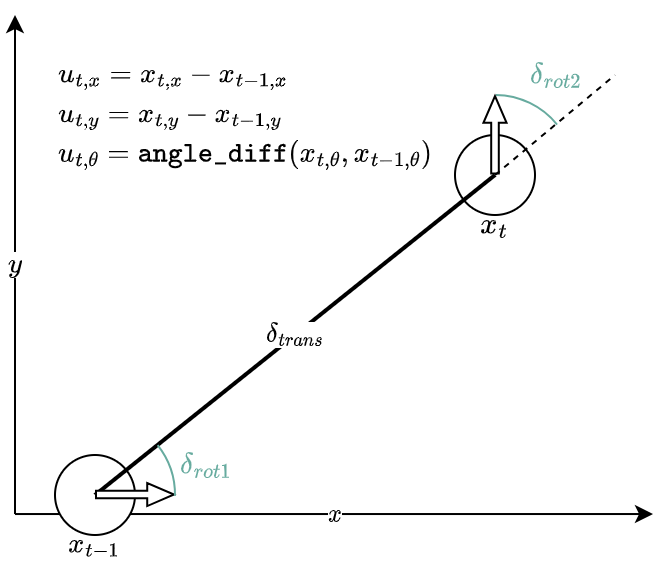

# SynPF

Here, you can tune different parameters for the **SynPF** algorithm, detailed in [*Robustness Evaluation of Localization Techniques for Autonomous Racing*](https://arxiv.org/abs/2401.07658). For a detailed treatment, read the thesis [here](./media/ForzaETH_Particle_Filter_Thesis.pdf).

The following options are in `cfg/pf2_params.yaml`. They will affect the performance of PF2.

## General Options
- `max_particles`: The number of particles in PF. Do not increase to 4000, as something really wacky goes on with CPU usage past that point. Tested 2000-3000 and it was safe.
  - Increasing the number of particles should improve the smoothness and accuracy of the pose estimate as there are more proposals.
- `max_range` : The maximum range to trust lidar scans. If encountering black tubes, then perhaps it is wise to tune this value lower. Else, you can set this as high as 25m.

## `rangelibc` options
`rangelibc` is the accelerator for localization that we inherit from MIT PF. It allows us to evaluate the sensor model very quickly. For best performance you can choose between three pairs of options of `range_method`, `rangelib_variant`.
- `glt, 3`: Giant Lookup Table, **fastest on CPU**. Check memory usage in `htop` if the map size is particularly large.
- `pcddt, 3`: Pruned Compressed Directional Distance Transform. Read MIT PF docs for more details. A slower but low-memory alternative to `glt`.
- `rmgpu, 2`: Ray-Marching GPU. **fastest overall**. Use if a GPU unit is available!

## Sensor Model Parameters.

- `z_hit`: Probability we hit intended target.
- `z_short`: Unexpected short reading. This could be turned up for H2H mode.
- `z_max`: out-of-range reading beyond `max_range`. This should be turned up for black tubes.
- `z_rand`: a reading anywhere in the valid range.
Note that these values should sum to 1. In practice since the Lidar is quite accurate, we can set `z_hit` quite high, and `z_max`, `z_rand` relatively low. Perhaps these could be tuned for TT vs H2H as H2H would give a higher chance of an unexpected short reading.

- `sigma_hit`: standard deviation (m) of hitting intended target. This should be relatively small, as the Lidar's accuracy is high.
- `lambda_short`: parameter of short-reading exponential distribution. Increase to make short readings more likely.

## Motion Model Options
There are basically two motion models of interest, and can be set with the `motion_model` parameter. Both are ways to get around the Ackermann-esque motion of the car (plus some side-slip).

### `tum`: TUM improvement to a diff-drive model

These are the equations that govern the size of the noise added.



$\delta_{rot1}$, $\delta_{rot2}$ are the first and second rotation distances in the diff-drive model; and $\delta_{trans}$ is the translation distance.

$\sigma_{rot1} = a_1 * \delta_{rot1} + a_2/max(\delta_{trans},\lambda_t)$

$\sigma_{rot2} = a_1 * \delta_{rot2} + a_2/max(\delta_{trans},\lambda_t)$

$\sigma_{trans} = a_3 * \delta_{trans} + a_4 * (\delta_{rot1} + \delta_{rot2})$

By adding Gaussian noise with variances determined above to the rotaitons and translations, we get a distribution of possible motions.

- `alpha_1`: How rotation affects rotation variance.
  - Recommended to keep between (0.0, 1.0)
- `alpha_2`: How translation affects rotation variance.
  - Recommended to keep between (0.0, 0.05)
  - Coupled with `lam_thresh`: change these values in unison.
- `alpha_3`: How translation affects translation variance 
  - Recommended to keep between (0.0, 5.0)
  - If facing localization problems at the end of the straight, think about increasing this.
  - It will make particles spread out further longitudinally.
- `alpha_4`: How rotation affects translation variance
  - Recommended to keep between (0.0, 1.0)
- `lam_thresh`: Minimum translation between frames for the TUM model to become effective.
  - If this is set lower, then rotational variance will become higher, see the equation for $\sigma_{r1}$ above.
  - Recommended to keep between(0.01, 0.2)
  - Generally calculating $a_2/\lambda_t=0.2$ is a safe place to start.

### `arc`: Arc Motion Model

This is an assumption that the car moves in an arc, following the Kinematic Bicycle Model.

> **CAUTION:** The `arc` motion model is quite experimental, and not included in the paper. Use at your own risk.


To compute the values of $x', y', \theta'$ given an initial position $x, y, \theta$ and odometry values **in the car's frame** ($\Delta_{x}, \Delta_{y}, \Delta_{\theta}$), the following equations can be applied.

First find the center of rotation. Because we assume we travel in an arc, we can find the radius of the arc.

$$r = \Delta_{x} / \Delta_{\theta}$$

Then find the coordinates of the center of the circle. This depends on the sign of $\Delta_{\theta}$. Add or subtract $\pi/2$ accordingly.

$$ c_x = x + r \cos(\theta \pm \pi/2)$$
$$ c_y = y + r \sin(\theta \pm \pi/2)$$

Then we can traverse points around $c$ at distance $r$, we just need the angle. At this point, we also add any lateral motion, $\Delta_y$.

$$ \phi = \text{arctan2}(y-c_y, x-c_x)$$
$$ \theta' = \Delta_{\theta} + \theta$$
$$ x' = C_x + r \cos(\phi + \Delta_{\theta}) + \Delta_y \cos(\theta' + \pi/2) $$
$$ y' = C_y + r \sin(\phi + \Delta_{\theta}) + \Delta_y \cos(\theta' + \pi/2) $$

### Perturbing the Arc motion model
Gaussian noise is added to the values $\Delta_{x}, \Delta_{y}, \Delta_{\theta}$.

The variance $\sigma_x$ varies linearly with its value. Further/faster motions are more uncertain. There is a minimum uncertainty $\sigma_{x,min}$ as well.

$$ \sigma_x = \max(\sigma_{x,min}, k_{x}|\Delta_x|) $$

The variance $\sigma_y$ varies both on $\Delta_y$ and also on $\Delta_x$, as at high linear speeds we want to exactly find the position of the vehicle laterally. There are minimum $\sigma_{y,min}$ and maximum $\sigma_{y,max}$ uncertainties as well.

$$ \sigma_y = \min(\sigma_{y,max}, \max(\sigma_{y,min}, k_{y}|\Delta_y| + f(\Delta_x))) $$

This function $f(\Delta_x)$ kicks in above a minimum value of $\Delta_x$, $\Delta_{xy,min}$, and subsequently scales it linearly by $k_{xy}$. Here $\mathbb{1}$ is the indicator function.

$$ f(\Delta_x) = k_{xy}(|\Delta_x|-\Delta_{xy,min}) * \mathbb{1}^{[|\Delta_x|>\Delta_{xy,min}]} $$

Lastly, the variance $\sigma_{theta}$ varies linearly with its value. Larger rotations are more uncertain. There is a minimum uncertainty $\sigma_{\theta,min}$ as well.

$$ \sigma_\theta = \max(\sigma_{\theta,min}, k_{\theta}|\Delta_\theta|) $$

These values correspond to these parameters:
- `motion_dispersion_arc_x` - $k_x$ how change in x affects x noise
- `motion_dispersion_arc_y` - $k_y$ how change in y affects y noise
- `motion_dispersion_arc_theta` - $k_\theta$ how change in theta affects theta noise
- `motion_dispersion_arc_xy` - $k_xy$ how change in x affects y noise
- `motion_dispersion_arc_x_min` - $\sigma_{x,min}$ min noise in x
- `motion_dispersion_arc_y_min` - $\sigma_{y,min}$ min noise in y
- `motion_dispersion_arc_y_max` - $\sigma_{y,max}$ max noise in y
- `motion_dispersion_arc_theta_min` - $\sigma_{\theta,min}$ min noise in theta
- `motion_dispersion_arc_xy_min_x` - $\Delta_{xy,min}$ min delta_x before it affects y scaling

The default values in `pf2_params` are reasonable.

## Testing the Different Range Methods and Rangelib Variants

The following settings were tested on an i7-1165G7 @ 2.80GHz.

| Test Case | Range Method | Rangelib Variant | Timing       | Comment          |
|-----------|--------------|------------------|--------------|------------------|
| 1         | PCDDT        | 4 CDDT Optimized | 15-25 iter/s | Most promising   |
| 2         | PCDDT        | 3 One Shot       | 13-21 iter/s |                  |
| 3         | PCDDT        | 2                | 11-24 iter/s | Default          |
| 4         | PCDDT        | 1                | 11-17 iter/s |                  |
| 5         | PCDDT        | 0                | 15-25 iter/s | Not working      |
| 6         | RM           | 2                | 11-14 iter/s |                  |
| 7         | CDDT         | 2                | 11-17 iter/s |                  |
| 8         | GLT          | 2                | 22-33 iter/s | Memory intensive |


# Installation

If you are in the `race_stack` docker environment, this should already be set up by default. If not, follow the commands [used for docker setup](../../.devcontainer/.install_utils/dev_pf_setup.sh). Note that we do not use the original [`RangeLibc`](https://github.com/kctess5/range_libc) library but rather [a fork of it](https://github.com/pmusau17/range_libc.git) which has updated install instructions for Python 3.

# Citing
If you found our work helpful in your research, we would appreciate if you cite it as follows:
```
@misc{lim2024robustness,
      title={Robustness Evaluation of Localization Techniques for Autonomous Racing}, 
      author={Tian Yi Lim and Edoardo Ghignone and Nicolas Baumann and Michele Magno},
      year={2024},
      eprint={2401.07658},
}
```
and if the full race stack, available [here](https://github.com/ForzaETH/race_stack), was also helpful, please cite it as:
```
@misc{baumann2024forzaeth,
      title={ForzaETH Race Stack - Scaled Autonomous Head-to-Head Racing on Fully Commercial off-the-Shelf Hardware}, 
      author={Nicolas Baumann and Edoardo Ghignone and Jonas Kühne and Niklas Bastuck and Jonathan Becker and Nadine Imholz and Tobias Kränzlin and Tian Yi Lim and Michael Lötscher and Luca Schwarzenbach and Luca Tognoni and Christian Vogt and Andrea Carron and Michele Magno},
      year={2024},
      eprint={2403.11784}
}
```

## Acknowledgements
This work was inspired by the MIT RACECAR project, available [here](https://github.com/mit-racecar/particle_filter).
